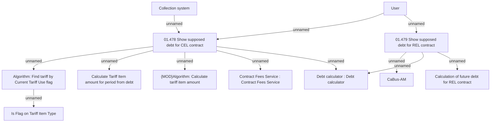

# Debt calculator

```mermaid
graph TD
    Debt_calculator_Debt_calculator["Debt calculator : Debt calculator"]
    User["User"]
    Calculate_Tariff_Item_amount_for_period_from_debt["Calculate Tariff Item amount for period from debt"]
    Is_Flag_on_Tariff_Item_Type["Is Flag on Tariff Item Type"]
    Contract_Fees_Service_Contract_Fees_Service["Contract Fees Service : Contract Fees Service"]
    Algorithm_Find_tariff_by_Current_Tariff_Use_flag["Algorithm: Find tariff by Current Tariff Use flag"]
    n_01_479_Show_supposed_debt_for_REL_contract["01.479 Show supposed debt for REL contract"]
    Collection_system["Collection system"]
    MOD_Algorithm_Calculate_tariff_item_amount["{MOD}Algorithm: Calculate tariff item amount"]
    CaBus_AM["CaBus-AM"]
    n_01_478_Show_supposed_debt_for_CEL_contract["01.478 Show supposed debt for CEL contract"]
    Calculation_of_future_debt_for_REL_contract["Calculation of future debt for REL contract"]
    Collection_system -->|unnamed| n_01_478_Show_supposed_debt_for_CEL_contract
    User -->|unnamed| n_01_478_Show_supposed_debt_for_CEL_contract
    Algorithm_Find_tariff_by_Current_Tariff_Use_flag -->|unnamed| Is_Flag_on_Tariff_Item_Type
    n_01_478_Show_supposed_debt_for_CEL_contract -->|unnamed| Algorithm_Find_tariff_by_Current_Tariff_Use_flag
    n_01_478_Show_supposed_debt_for_CEL_contract -->|unnamed| Calculate_Tariff_Item_amount_for_period_from_debt
    n_01_478_Show_supposed_debt_for_CEL_contract -->|unnamed| MOD_Algorithm_Calculate_tariff_item_amount
    n_01_478_Show_supposed_debt_for_CEL_contract -->|unnamed| Contract_Fees_Service_Contract_Fees_Service
    User -->|unnamed| n_01_479_Show_supposed_debt_for_REL_contract
    n_01_479_Show_supposed_debt_for_REL_contract -->|unnamed| CaBus_AM
    n_01_479_Show_supposed_debt_for_REL_contract -->|unnamed| Debt_calculator_Debt_calculator
    n_01_478_Show_supposed_debt_for_CEL_contract -->|unnamed| Debt_calculator_Debt_calculator
    n_01_479_Show_supposed_debt_for_REL_contract -->|unnamed| Calculation_of_future_debt_for_REL_contract
```
