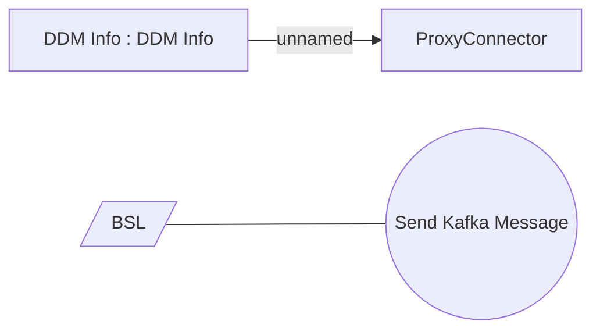

# Send Kafka Message

- **Diagram Type**: Use Case
- **Package**: HomerSelect/BSL/Modules/Direct debit (DD)/Use Case Model
- **Diagram ID**: 162574
- **Elements**: 4
- **Connectors**: 2

```mermaid
graph LR
    ProxyConnector["ProxyConnector"]
    DDM_Info_DDM_Info["DDM Info : DDM Info"]
    BSL[/"BSL"/]
    Send_Kafka_Message(("Send Kafka Message"))
    DDM_Info_DDM_Info -->|unnamed| ProxyConnector
    BSL --- Send_Kafka_Message
```
