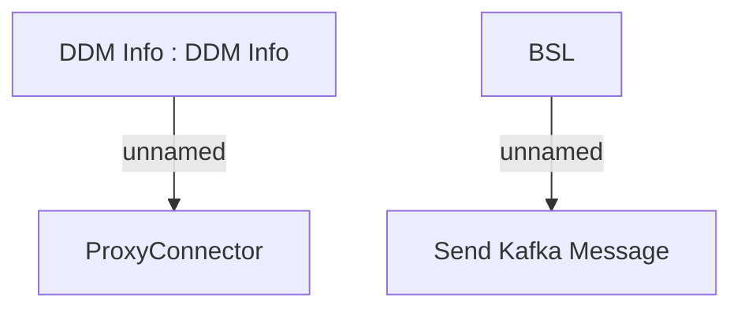

# Send Kafka Message

```mermaid
graph TD
    ProxyConnector["ProxyConnector"]
    DDM_Info_DDM_Info["DDM Info : DDM Info"]
    BSL["BSL"]
    Send_Kafka_Message["Send Kafka Message"]
    DDM_Info_DDM_Info -->|unnamed| ProxyConnector
    BSL -->|unnamed| Send_Kafka_Message
```
