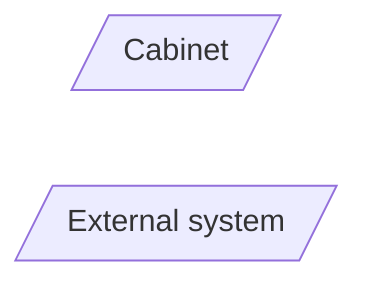

# Actors

- **Diagram Type**: Use Case
- **Package**: HomerSelect/BSL/Modules/Document management (DMS)/Analytical Model/Actors
- **Diagram ID**: 141268
- **Elements**: 2
- **Connectors**: 0

```mermaid
graph LR
    Cabinet[/"Cabinet"/]
    External_system[/"External system"/]
```
