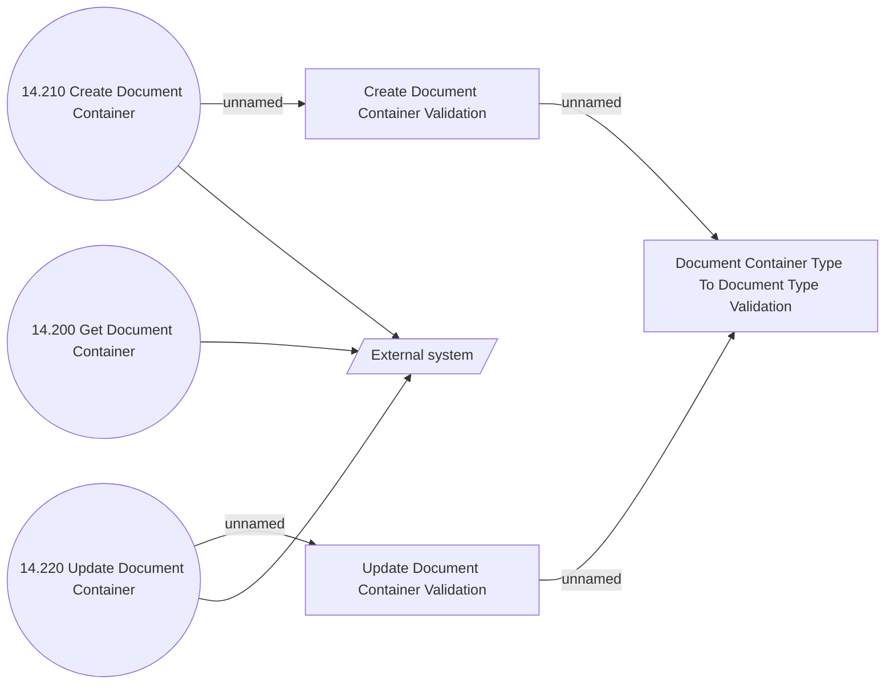

# Use Case Model

- **Diagram Type**: Use Case
- **Package**: HomerSelect/BSL/Modules/Document management (DMS)/Analytical Model/Document Container/Use Case Model
- **Diagram ID**: 141853
- **Elements**: 7
- **Connectors**: 7

