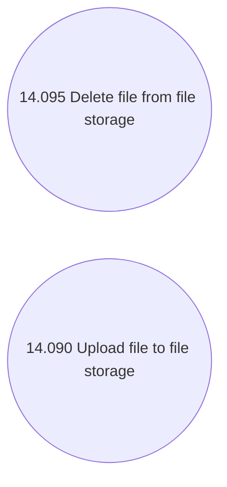

# Use Case Model

- **Diagram Type**: Use Case
- **Package**: HomerSelect/BSL/Modules/Document management (DMS)/Analytical Model/Document Instances/Integration with file storage/Use Case Model
- **Diagram ID**: 146087
- **Elements**: 2
- **Connectors**: 0

