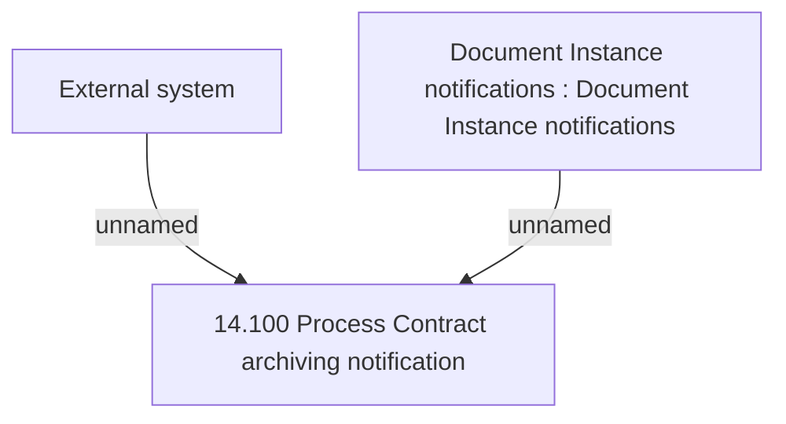

# Document notifications - Use Case Model

```mermaid
graph TD
    Document_Instance_notifications_Document_Instance_notificati["Document Instance notifications : Document Instance notifications"]
    n_14_100_Process_Contract_archiving_notification["14.100 Process Contract archiving notification"]
    External_system["External system"]
    External_system -->|unnamed| n_14_100_Process_Contract_archiving_notification
    Document_Instance_notifications_Document_Instance_notificati -->|unnamed| n_14_100_Process_Contract_archiving_notification
```
