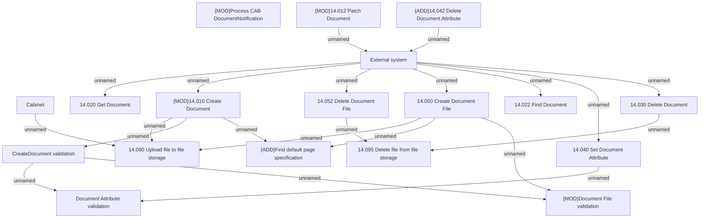

# Document services - Use Case Model

```mermaid
graph TD
    MOD_Process_CAB_DocumentNotification["{MOD}Process CAB DocumentNotification"]
    MOD_14_012_Patch_Document["{MOD}14.012 Patch Document"]
    ADD_14_042_Delete_Document_Attribute["{ADD}14.042 Delete Document Attribute"]
    Cabinet["Cabinet"]
    External_system["External system"]
    ADD_Find_default_page_specification["{ADD}Find default page specification"]
    n_14_095_Delete_file_from_file_storage["14.095 Delete file from file storage"]
    n_14_090_Upload_file_to_file_storage["14.090 Upload file to file storage"]
    MOD_Document_File_validation["{MOD}Document File validation"]
    Document_Attribute_validation["Document Attribute validation"]
    CreateDocument_validation["CreateDocument validation"]
    n_14_052_Delete_Document_File["14.052 Delete Document File"]
    n_14_050_Create_Document_File["14.050 Create Document File"]
    n_14_040_Set_Document_Attribute["14.040 Set Document Attribute"]
    n_14_030_Delete_Document["14.030 Delete Document"]
    n_14_022_Find_Document["14.022 Find Document"]
    n_14_020_Get_Document["14.020 Get Document"]
    MOD_14_010_Create_Document["{MOD}14.010 Create Document"]
    CreateDocument_validation -->|unnamed| MOD_Document_File_validation
    ADD_14_042_Delete_Document_Attribute -->|unnamed| External_system
    Cabinet -->|unnamed| n_14_090_Upload_file_to_file_storage
    External_system -->|unnamed| n_14_030_Delete_Document
    External_system -->|unnamed| n_14_040_Set_Document_Attribute
    External_system -->|unnamed| n_14_022_Find_Document
    External_system -->|unnamed| n_14_050_Create_Document_File
    External_system -->|unnamed| n_14_052_Delete_Document_File
    External_system -->|unnamed| MOD_14_010_Create_Document
    MOD_14_012_Patch_Document -->|unnamed| External_system
    CreateDocument_validation -->|unnamed| Document_Attribute_validation
    MOD_14_010_Create_Document -->|unnamed| ADD_Find_default_page_specification
    n_14_052_Delete_Document_File -->|unnamed| n_14_095_Delete_file_from_file_storage
    n_14_050_Create_Document_File -->|unnamed| MOD_Document_File_validation
    n_14_050_Create_Document_File -->|unnamed| ADD_Find_default_page_specification
    n_14_050_Create_Document_File -->|unnamed| n_14_090_Upload_file_to_file_storage
    n_14_040_Set_Document_Attribute -->|unnamed| Document_Attribute_validation
    n_14_030_Delete_Document -->|unnamed| n_14_095_Delete_file_from_file_storage
    MOD_14_010_Create_Document -->|unnamed| CreateDocument_validation
    MOD_14_010_Create_Document -->|unnamed| n_14_090_Upload_file_to_file_storage
    External_system -->|unnamed| n_14_020_Get_Document
```
