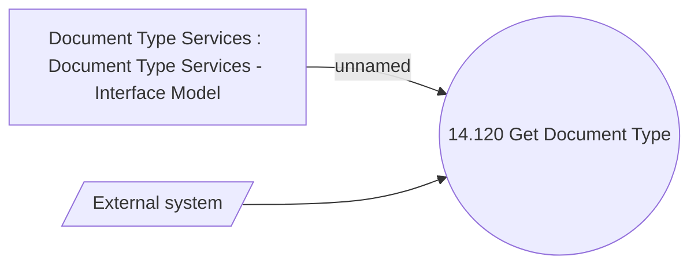

# Use Case Model

- **Diagram Type**: Use Case
- **Package**: HomerSelect/BSL/Modules/Document management (DMS)/Analytical Model/Document Type Definition/Use Case Model
- **Diagram ID**: 141781
- **Elements**: 3
- **Connectors**: 2

