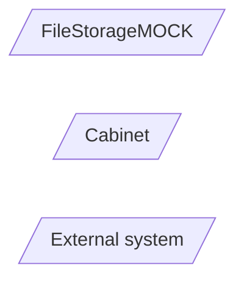

# Actors

- **Diagram Type**: Use Case
- **Package**: HomerSelect/BSL/Modules/Document management (DMS_NG)/Analytical Model/Actors
- **Diagram ID**: 162099
- **Elements**: 3
- **Connectors**: 0

```mermaid
graph LR
    FileStorageMOCK[/"FileStorageMOCK"/]
    Cabinet[/"Cabinet"/]
    External_system[/"External system"/]
```
