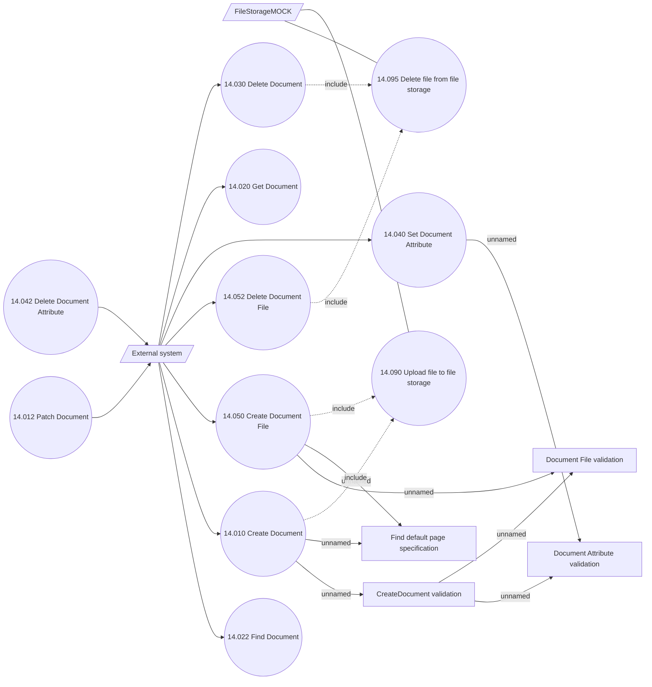

# Document services - Use Case Model

- **Diagram Type**: Use Case
- **Package**: HomerSelect/BSL/Modules/Document management (DMS_NG)/Analytical Model/Document Instances/Use Case Model
- **Diagram ID**: 162123
- **Elements**: 17
- **Connectors**: 22

