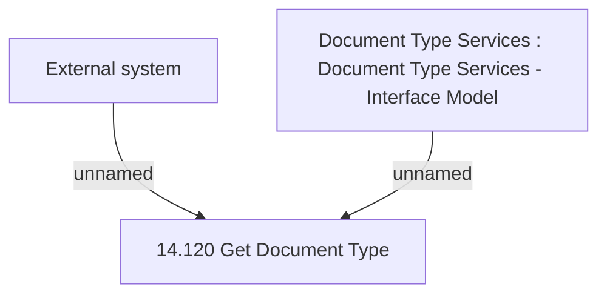

# Use Case Model

```mermaid
graph TD
    Document_Type_Services_Document_Type_Services_Interface_Mode["Document Type Services : Document Type Services - Interface Model"]
    External_system["External system"]
    n_14_120_Get_Document_Type["14.120 Get Document Type"]
    External_system -->|unnamed| n_14_120_Get_Document_Type
    Document_Type_Services_Document_Type_Services_Interface_Mode -->|unnamed| n_14_120_Get_Document_Type
```
