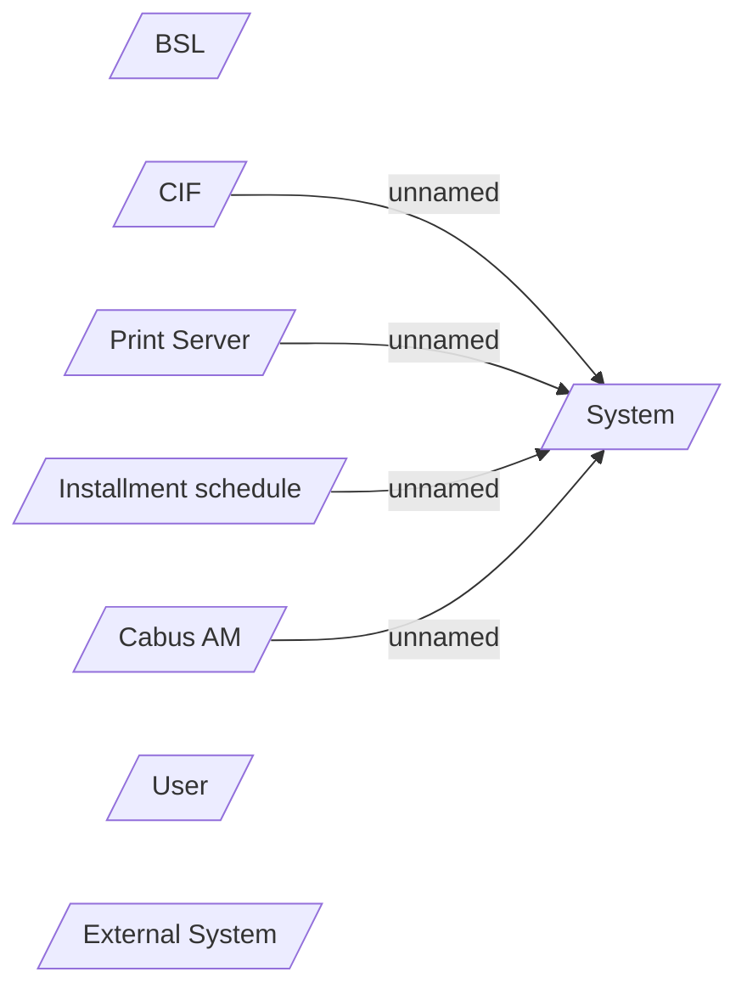

# Incoming Payments - Actors

- **Diagram Type**: Use Case
- **Package**: HomerSelect/BSL/Modules/Incoming Payments/Analytical Model/Actors
- **Diagram ID**: 164273
- **Elements**: 8
- **Connectors**: 4

