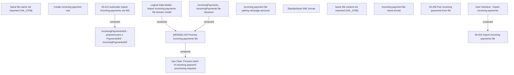

# Import incoming payments

```mermaid
graph TD
    IncomingPaymentsWS_prejmenovano_z_PaymentsWS_IncomingPayment["IncomingPaymentsWS - prejmenovano z PaymentsWS : IncomingPaymentsWS"]
    Same_file_name_not_imported_VAL_0708["Same file name not imported (VAL_0708)"]
    Create_incoming_payment_rule["Create incoming payment rule"]
    Use_Case_Process_batch_of_incoming_payment_processing_reques["Use Case :Process batch of incoming payment processing requests"]
    User_Interface_Import_incoming_payments["User Interface : Import incoming payments"]
    Logical_Data_Model_Import_incoming_payments_file_domain_mode["Logical Data Model : Import incoming payments file domain model"]
    IncomingPayments_IncomingPayments_file_structure["IncomingPayments : IncomingPayments file structure"]
    Incoming_payment_file_pairing_message_structure["Incoming payment file pairing message structure"]
    Standardized_XML_format["Standardized XML format"]
    Same_file_content_not_imported_VAL_0709["Same file content not imported (VAL_0709)"]
    Incoming_payment_file_name_format["Incoming payment file name format"]
    n_05_295_Pair_incoming_payments_from_file["05.295 Pair incoming payments from file"]
    n_05_012_Automatic_import_incoming_payments_via_WS["05.012 Automatic import incoming payments via WS"]
    MOD_05_220_Process_incoming_payments_file["{MOD}05.220 Process incoming payments file"]
    n_05_010_Import_incoming_payments_file["05.010 Import incoming payments file"]
    MOD_05_220_Process_incoming_payments_file -->|unnamed| Use_Case_Process_batch_of_incoming_payment_processing_reques
    n_05_012_Automatic_import_incoming_payments_via_WS -->|unnamed| IncomingPaymentsWS_prejmenovano_z_PaymentsWS_IncomingPayment
    User_Interface_Import_incoming_payments -->|unnamed| n_05_010_Import_incoming_payments_file
    Logical_Data_Model_Import_incoming_payments_file_domain_mode -->|unnamed| MOD_05_220_Process_incoming_payments_file
    IncomingPayments_IncomingPayments_file_structure -->|unnamed| MOD_05_220_Process_incoming_payments_file
```
