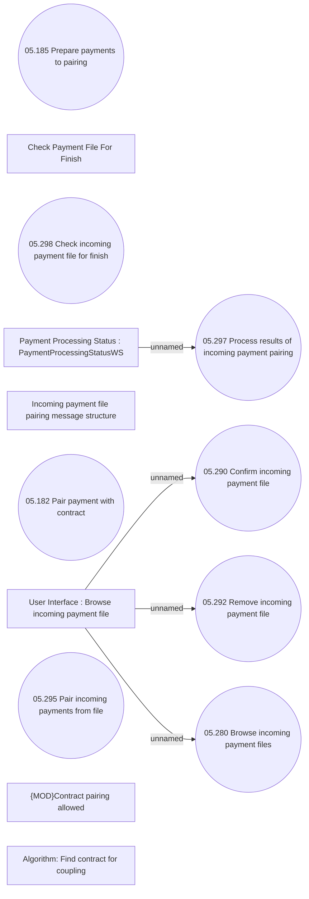

# Pairing incoming payments from file

- **Diagram Type**: Use Case
- **Package**: HomerSelect/BSL/Modules/Incoming Payments/Analytical Model/Import incoming payments/Use Case Model
- **Diagram ID**: 164569
- **Elements**: 14
- **Connectors**: 4

