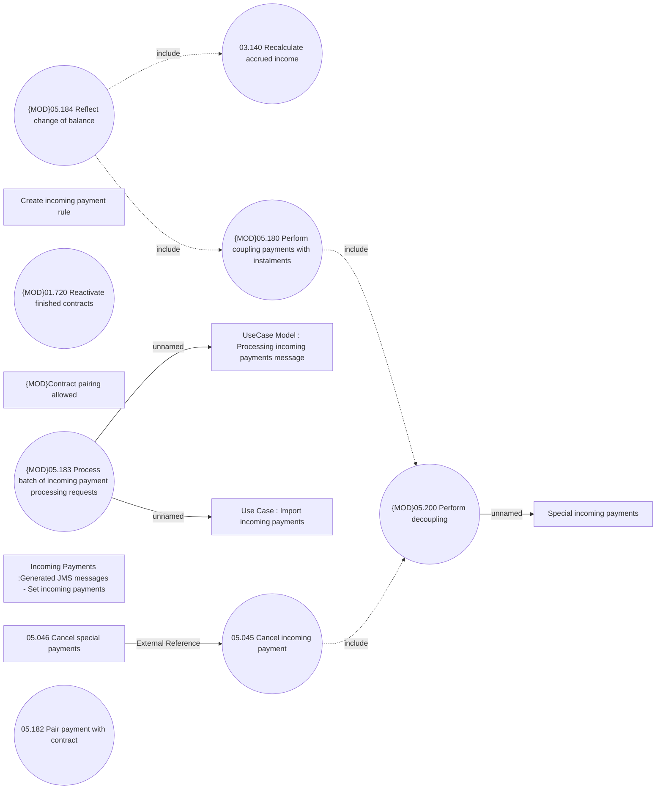

# Process batch of incoming payment processing requests

- **Diagram Type**: Use Case
- **Package**: HomerSelect/BSL/Modules/Incoming Payments/Analytical Model/Import incoming payments/Use Case Model
- **Diagram ID**: 164570
- **Elements**: 15
- **Connectors**: 8

