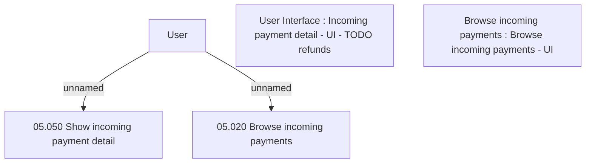

# Browse and show incoming payments 

```mermaid
graph TD
    n_05_050_Show_incoming_payment_detail["05.050 Show incoming payment detail"]
    User["User"]
    User_Interface_Incoming_payment_detail_UI_TODO_refunds["User Interface : Incoming payment detail - UI - TODO refunds"]
    n_05_020_Browse_incoming_payments["05.020 Browse incoming payments"]
    Browse_incoming_payments_Browse_incoming_payments_UI["Browse incoming payments : Browse incoming payments - UI"]
    User -->|unnamed| n_05_050_Show_incoming_payment_detail
    User -->|unnamed| n_05_020_Browse_incoming_payments
```
