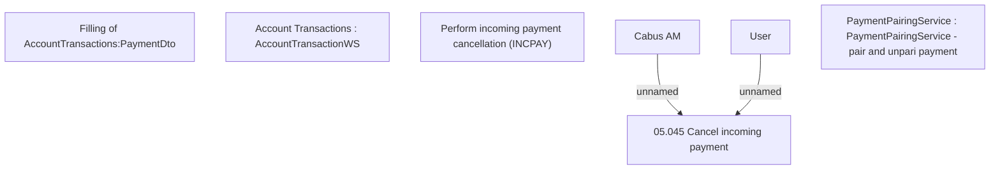

# Cancel incoming payment

```mermaid
graph TD
    Filling_of_AccountTransactions_PaymentDto["Filling of AccountTransactions:PaymentDto"]
    Account_Transactions_AccountTransactionWS["Account Transactions : AccountTransactionWS"]
    Perform_incoming_payment_cancellation_INCPAY["Perform incoming payment cancellation (INCPAY)"]
    n_05_045_Cancel_incoming_payment["05.045 Cancel incoming payment"]
    Cabus_AM["Cabus AM"]
    User["User"]
    PaymentPairingService_PaymentPairingService_pair_and_unpari_["PaymentPairingService : PaymentPairingService - pair and unpari payment"]
    Cabus_AM -->|unnamed| n_05_045_Cancel_incoming_payment
    User -->|unnamed| n_05_045_Cancel_incoming_payment
```
