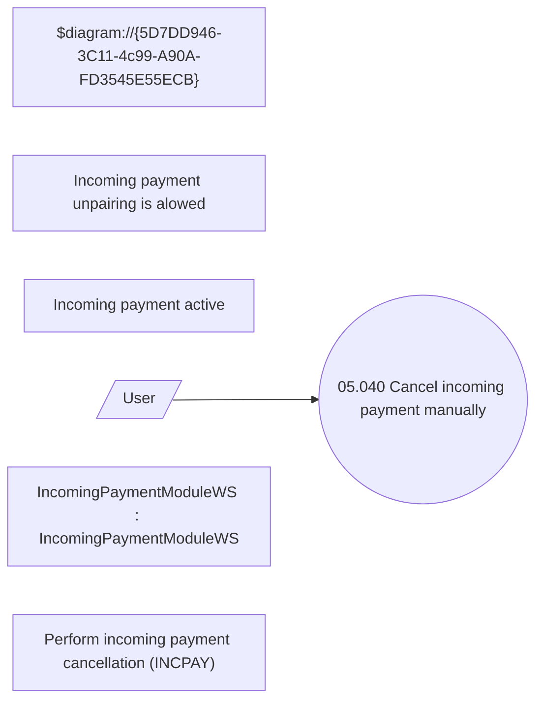

# Cancellation incoming payment manually

- **Diagram Type**: Use Case
- **Package**: HomerSelect/BSL/Modules/Incoming Payments/Analytical Model/Management of incoming payments/UseCase Model
- **Diagram ID**: 164591
- **Elements**: 7
- **Connectors**: 1

