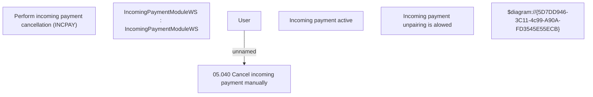

# Cancellation incoming payment manually

```mermaid
graph TD
    Perform_incoming_payment_cancellation_INCPAY["Perform incoming payment cancellation (INCPAY)"]
    IncomingPaymentModuleWS_IncomingPaymentModuleWS["IncomingPaymentModuleWS : IncomingPaymentModuleWS"]
    User["User"]
    Incoming_payment_active["Incoming payment active"]
    Incoming_payment_unpairing_is_alowed["Incoming payment unpairing is alowed"]
    diagram_5D7DD946_3C11_4c99_A90A_FD3545E55ECB["$diagram://{5D7DD946-3C11-4c99-A90A-FD3545E55ECB}"]
    n_05_040_Cancel_incoming_payment_manually["05.040 Cancel incoming payment manually"]
    User -->|unnamed| n_05_040_Cancel_incoming_payment_manually
```
