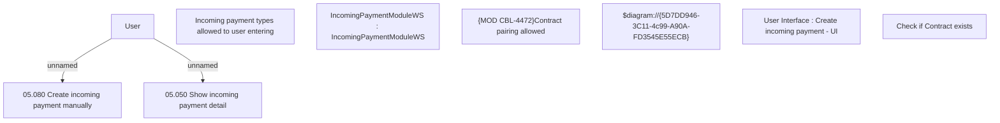

# Creating incoming payment

```mermaid
graph TD
    n_05_050_Show_incoming_payment_detail["05.050 Show incoming payment detail"]
    User["User"]
    Incoming_payment_types_allowed_to_user_entering["Incoming payment types allowed to user entering"]
    n_05_080_Create_incoming_payment_manually["05.080 Create incoming payment manually"]
    IncomingPaymentModuleWS_IncomingPaymentModuleWS["IncomingPaymentModuleWS : IncomingPaymentModuleWS"]
    MOD_CBL_4472_Contract_pairing_allowed["{MOD CBL-4472}Contract pairing allowed"]
    diagram_5D7DD946_3C11_4c99_A90A_FD3545E55ECB["$diagram://{5D7DD946-3C11-4c99-A90A-FD3545E55ECB}"]
    User_Interface_Create_incoming_payment_UI["User Interface : Create incoming payment - UI"]
    Check_if_Contract_exists["Check if Contract exists"]
    User -->|unnamed| n_05_080_Create_incoming_payment_manually
    User -->|unnamed| n_05_050_Show_incoming_payment_detail
```
