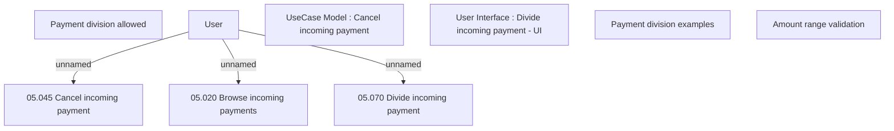

# Divide incoming payment

```mermaid
graph TD
    Payment_division_allowed["Payment division allowed"]
    User["User"]
    UseCase_Model_Cancel_incoming_payment["UseCase Model : Cancel incoming payment"]
    n_05_020_Browse_incoming_payments["05.020 Browse incoming payments"]
    n_05_070_Divide_incoming_payment["05.070 Divide incoming payment"]
    User_Interface_Divide_incoming_payment_UI["User Interface : Divide incoming payment - UI"]
    Payment_division_examples["Payment division examples"]
    Amount_range_validation["Amount range validation"]
    n_05_045_Cancel_incoming_payment["05.045 Cancel incoming payment"]
    User -->|unnamed| n_05_045_Cancel_incoming_payment
    User -->|unnamed| n_05_020_Browse_incoming_payments
    User -->|unnamed| n_05_070_Divide_incoming_payment
```
