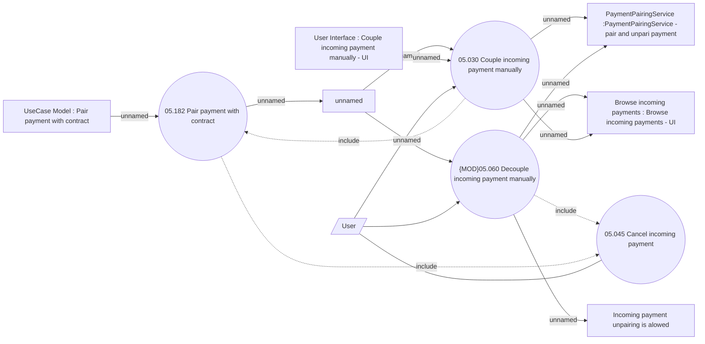

# Couple and decouple incoming payment manually

- **Diagram Type**: Use Case
- **Package**: HomerSelect/BSL/Modules/Incoming Payments/Analytical Model/Pairing incoming payments/UseCase Model
- **Diagram ID**: 164100
- **Elements**: 14
- **Connectors**: 16

