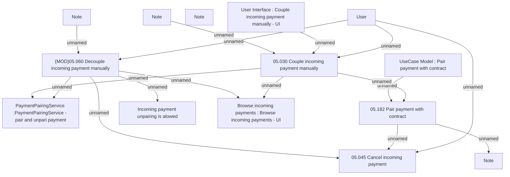

# Couple and decouple incoming payment manually

```mermaid
graph TD
    UseCase_Model_Pair_payment_with_contract["UseCase Model : Pair payment with contract"]
    PaymentPairingService_PaymentPairingService_pair_and_unpari_["PaymentPairingService :PaymentPairingService - pair and unpari payment"]
    el_1875784["Note"]
    n_05_182_Pair_payment_with_contract["05.182 Pair payment with contract"]
    el_1875794["Note"]
    el_1875789["Note"]
    n_05_045_Cancel_incoming_payment["05.045 Cancel incoming payment"]
    el_1877230["Note"]
    Incoming_payment_unpairing_is_alowed["Incoming payment unpairing is alowed"]
    Browse_incoming_payments_Browse_incoming_payments_UI["Browse incoming payments : Browse incoming payments - UI"]
    User_Interface_Couple_incoming_payment_manually_UI["User Interface : Couple incoming payment manually - UI"]
    User["User"]
    MOD_05_060_Decouple_incoming_payment_manually["{MOD}05.060 Decouple incoming payment manually"]
    n_05_030_Couple_incoming_payment_manually["05.030 Couple incoming payment manually"]
    n_05_030_Couple_incoming_payment_manually -->|unnamed| PaymentPairingService_PaymentPairingService_pair_and_unpari_
    n_05_182_Pair_payment_with_contract -->|unnamed| el_1875784
    UseCase_Model_Pair_payment_with_contract -->|unnamed| n_05_182_Pair_payment_with_contract
    n_05_030_Couple_incoming_payment_manually -->|unnamed| n_05_182_Pair_payment_with_contract
    MOD_05_060_Decouple_incoming_payment_manually -->|unnamed| n_05_045_Cancel_incoming_payment
    n_05_182_Pair_payment_with_contract -->|unnamed| n_05_045_Cancel_incoming_payment
    MOD_05_060_Decouple_incoming_payment_manually -->|unnamed| PaymentPairingService_PaymentPairingService_pair_and_unpari_
    MOD_05_060_Decouple_incoming_payment_manually -->|unnamed| Incoming_payment_unpairing_is_alowed
    el_1875789 -->|unnamed| n_05_030_Couple_incoming_payment_manually
    MOD_05_060_Decouple_incoming_payment_manually -->|unnamed| Browse_incoming_payments_Browse_incoming_payments_UI
    n_05_030_Couple_incoming_payment_manually -->|unnamed| Browse_incoming_payments_Browse_incoming_payments_UI
    el_1875794 -->|unnamed| MOD_05_060_Decouple_incoming_payment_manually
    User_Interface_Couple_incoming_payment_manually_UI -->|unnamed| n_05_030_Couple_incoming_payment_manually
    User -->|unnamed| n_05_045_Cancel_incoming_payment
    User -->|unnamed| MOD_05_060_Decouple_incoming_payment_manually
    User -->|unnamed| n_05_030_Couple_incoming_payment_manually
```
