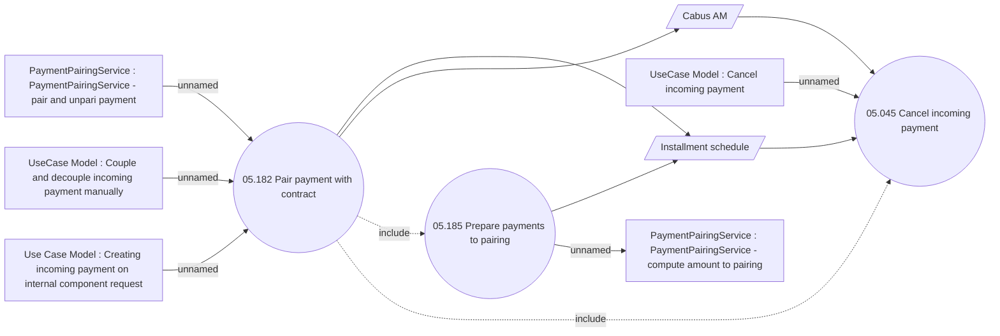

# Pair payment with contract

- **Diagram Type**: Use Case
- **Package**: HomerSelect/BSL/Modules/Incoming Payments/Analytical Model/Pairing incoming payments/UseCase Model
- **Diagram ID**: 164101
- **Elements**: 10
- **Connectors**: 12

