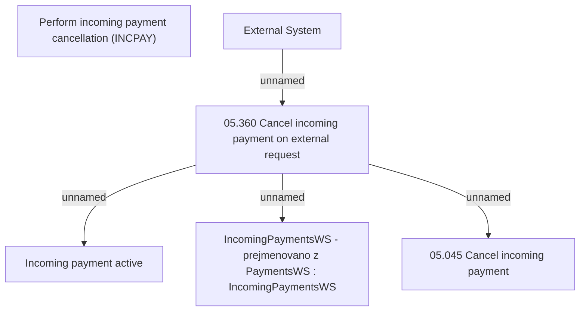

# Cancellation incoming payment on external request

```mermaid
graph TD
    Perform_incoming_payment_cancellation_INCPAY["Perform incoming payment cancellation (INCPAY)"]
    n_05_045_Cancel_incoming_payment["05.045 Cancel incoming payment"]
    IncomingPaymentsWS_prejmenovano_z_PaymentsWS_IncomingPayment["IncomingPaymentsWS - prejmenovano z PaymentsWS : IncomingPaymentsWS"]
    Incoming_payment_active["Incoming payment active"]
    n_05_360_Cancel_incoming_payment_on_external_request["05.360 Cancel incoming payment on external request"]
    External_System["External System"]
    n_05_360_Cancel_incoming_payment_on_external_request -->|unnamed| Incoming_payment_active
    n_05_360_Cancel_incoming_payment_on_external_request -->|unnamed| IncomingPaymentsWS_prejmenovano_z_PaymentsWS_IncomingPayment
    n_05_360_Cancel_incoming_payment_on_external_request -->|unnamed| n_05_045_Cancel_incoming_payment
    External_System -->|unnamed| n_05_360_Cancel_incoming_payment_on_external_request
```
