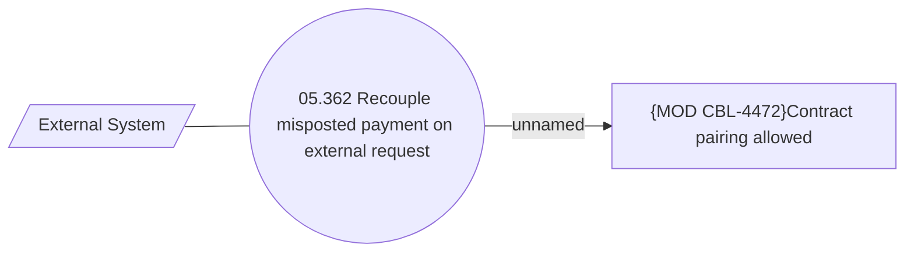

# Recouple misposted payment on external request

- **Diagram Type**: Use Case
- **Package**: HomerSelect/BSL/Modules/Incoming Payments/Analytical Model/Process external request on incoming payment/Use Case Model
- **Diagram ID**: 161981
- **Elements**: 3
- **Connectors**: 2

