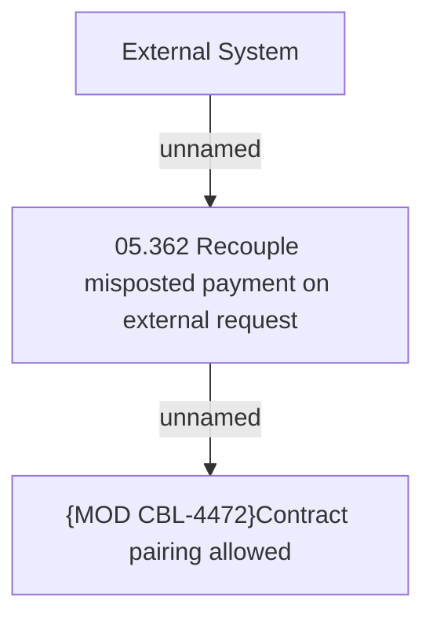

# Recouple misposted payment on external request

```mermaid
graph TD
    MOD_CBL_4472_Contract_pairing_allowed["{MOD CBL-4472}Contract pairing allowed"]
    n_05_362_Recouple_misposted_payment_on_external_request["05.362 Recouple misposted payment on external request"]
    External_System["External System"]
    n_05_362_Recouple_misposted_payment_on_external_request -->|unnamed| MOD_CBL_4472_Contract_pairing_allowed
    External_System -->|unnamed| n_05_362_Recouple_misposted_payment_on_external_request
```
