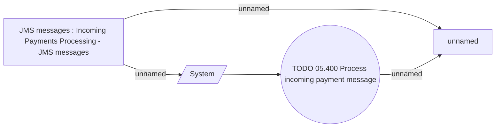

# Processing incoming payments message

- **Diagram Type**: Use Case
- **Package**: HomerSelect/BSL/Modules/Incoming Payments/Analytical Model/Process incoming payment message/UseCase Model
- **Diagram ID**: 143091
- **Elements**: 4
- **Connectors**: 4

