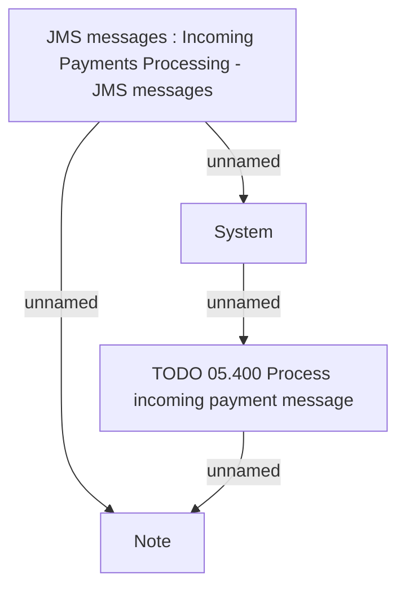

# Processing incoming payments message

```mermaid
graph TD
    JMS_messages_Incoming_Payments_Processing_JMS_messages["JMS messages : Incoming Payments Processing - JMS messages"]
    System["System"]
    el_1673363["Note"]
    TODO_05_400_Process_incoming_payment_message["TODO 05.400 Process incoming payment message"]
    JMS_messages_Incoming_Payments_Processing_JMS_messages -->|unnamed| el_1673363
    TODO_05_400_Process_incoming_payment_message -->|unnamed| el_1673363
    JMS_messages_Incoming_Payments_Processing_JMS_messages -->|unnamed| System
    System -->|unnamed| TODO_05_400_Process_incoming_payment_message
```
