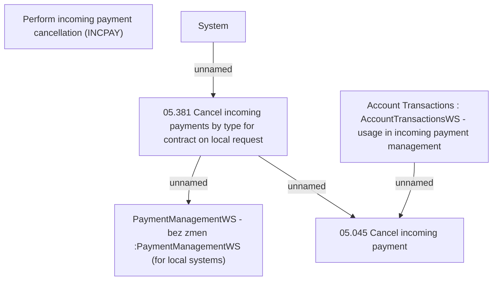

# Cancel incoming payments by type for contract on local request

```mermaid
graph TD
    Account_Transactions_AccountTransactionsWS_usage_in_incoming["Account Transactions : AccountTransactionsWS - usage in incoming payment management"]
    n_05_045_Cancel_incoming_payment["05.045 Cancel incoming payment"]
    Perform_incoming_payment_cancellation_INCPAY["Perform incoming payment cancellation (INCPAY)"]
    PaymentManagementWS_bez_zmen_PaymentManagementWS_for_local_s["PaymentManagementWS - bez zmen :PaymentManagementWS (for local systems)"]
    n_05_381_Cancel_incoming_payments_by_type_for_contract_on_lo["05.381 Cancel incoming payments by type for contract on local request"]
    System["System"]
    n_05_381_Cancel_incoming_payments_by_type_for_contract_on_lo -->|unnamed| PaymentManagementWS_bez_zmen_PaymentManagementWS_for_local_s
    n_05_381_Cancel_incoming_payments_by_type_for_contract_on_lo -->|unnamed| n_05_045_Cancel_incoming_payment
    Account_Transactions_AccountTransactionsWS_usage_in_incoming -->|unnamed| n_05_045_Cancel_incoming_payment
    System -->|unnamed| n_05_381_Cancel_incoming_payments_by_type_for_contract_on_lo
```
