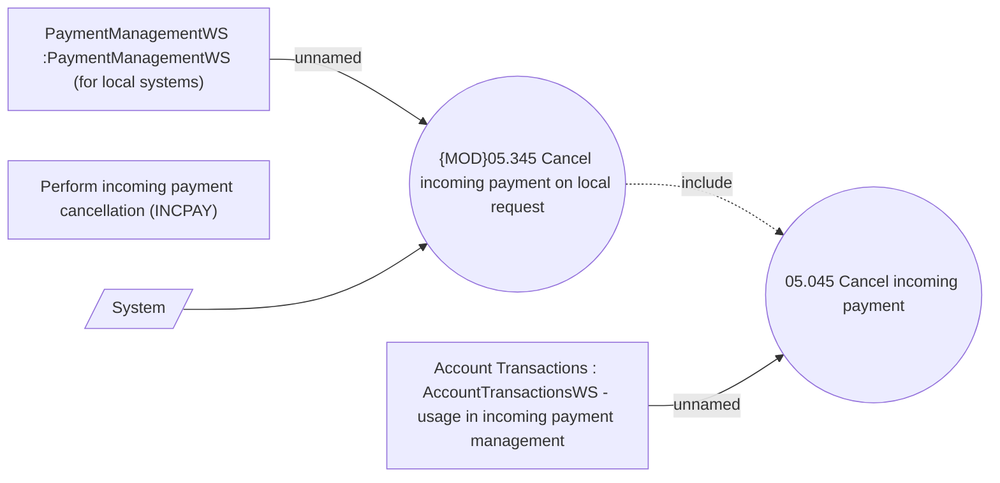

# Cancelation incoming payment on internal component request

- **Diagram Type**: Use Case
- **Package**: HomerSelect/BSL/Modules/Incoming Payments/Analytical Model/Process internal request on incoming payment/Use Case Model
- **Diagram ID**: 143093
- **Elements**: 6
- **Connectors**: 4

