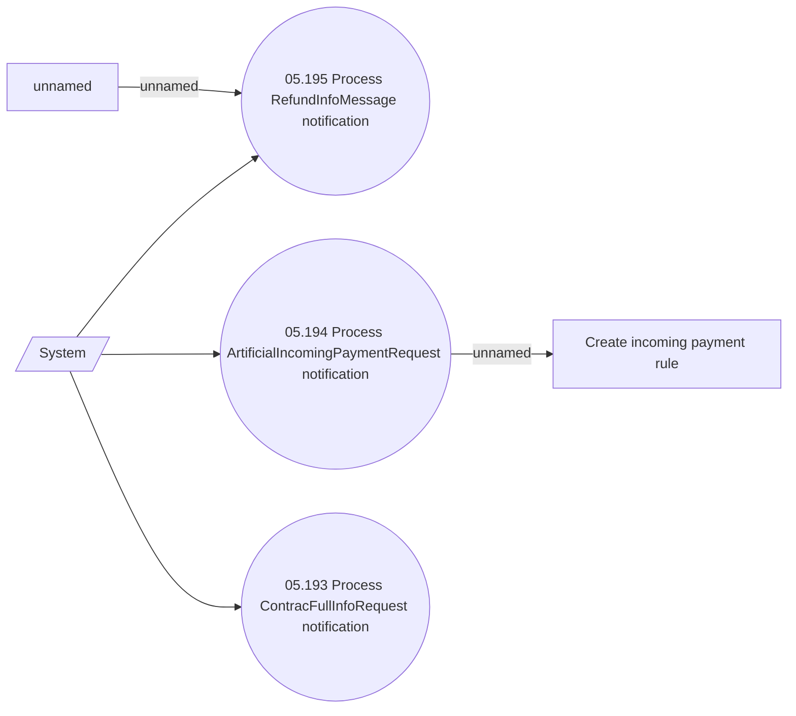

# Process notifications from other systems

- **Diagram Type**: Use Case
- **Package**: HomerSelect/BSL/Modules/Incoming Payments/Analytical Model/Process notifications from other systems/UseCase Model
- **Diagram ID**: 142936
- **Elements**: 6
- **Connectors**: 5

