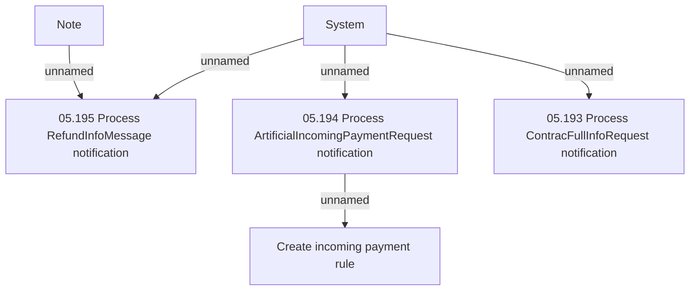

# Process notifications from other systems

```mermaid
graph TD
    el_1671784["Note"]
    n_05_195_Process_RefundInfoMessage_notification["05.195 Process RefundInfoMessage notification"]
    Create_incoming_payment_rule["Create incoming payment rule"]
    n_05_194_Process_ArtificialIncomingPaymentRequest_notificati["05.194 Process ArtificialIncomingPaymentRequest notification"]
    System["System"]
    n_05_193_Process_ContracFullInfoRequest_notification["05.193 Process ContracFullInfoRequest notification"]
    n_05_194_Process_ArtificialIncomingPaymentRequest_notificati -->|unnamed| Create_incoming_payment_rule
    el_1671784 -->|unnamed| n_05_195_Process_RefundInfoMessage_notification
    System -->|unnamed| n_05_195_Process_RefundInfoMessage_notification
    System -->|unnamed| n_05_193_Process_ContracFullInfoRequest_notification
    System -->|unnamed| n_05_194_Process_ArtificialIncomingPaymentRequest_notificati
```
