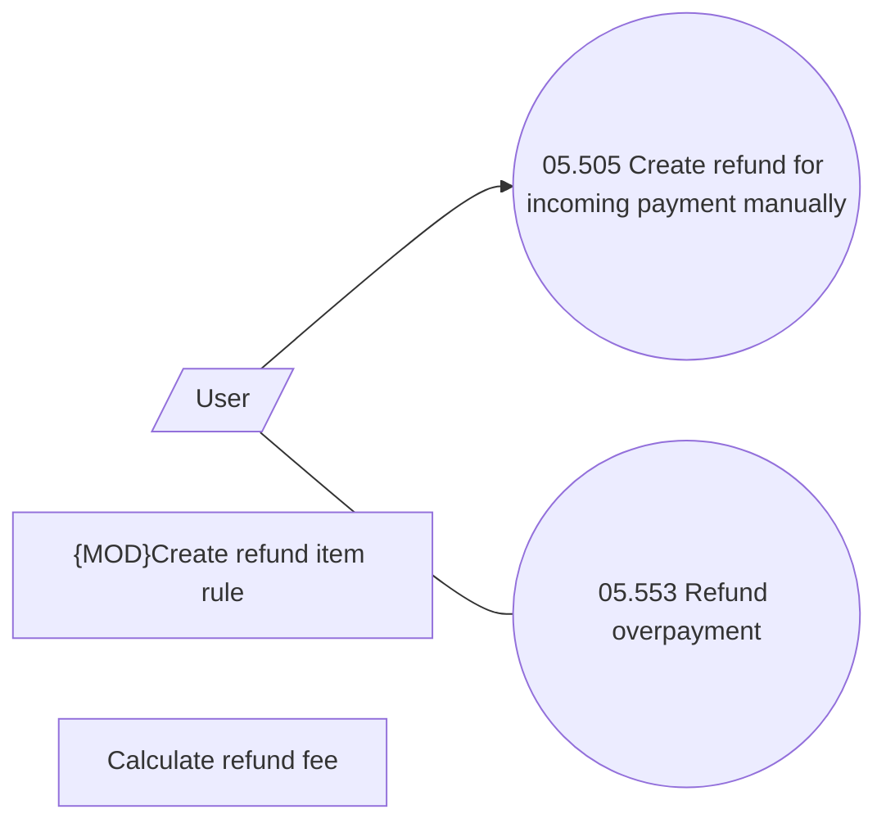

# Creating Refunds manually

- **Diagram Type**: Use Case
- **Package**: HomerSelect/BSL/Modules/Incoming Payments/Analytical Model/Refunds/Use Case Model
- **Diagram ID**: 164597
- **Elements**: 5
- **Connectors**: 2

