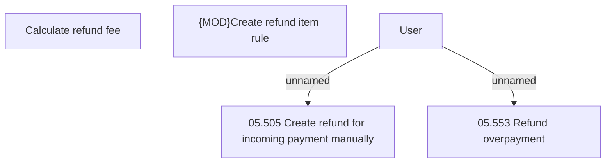

# Creating Refunds manually

```mermaid
graph TD
    n_05_553_Refund_overpayment["05.553 Refund overpayment"]
    Calculate_refund_fee["Calculate refund fee "]
    MOD_Create_refund_item_rule["{MOD}Create refund item rule"]
    n_05_505_Create_refund_for_incoming_payment_manually["05.505 Create refund for incoming payment manually"]
    User["User"]
    User -->|unnamed| n_05_505_Create_refund_for_incoming_payment_manually
    User -->|unnamed| n_05_553_Refund_overpayment
```
