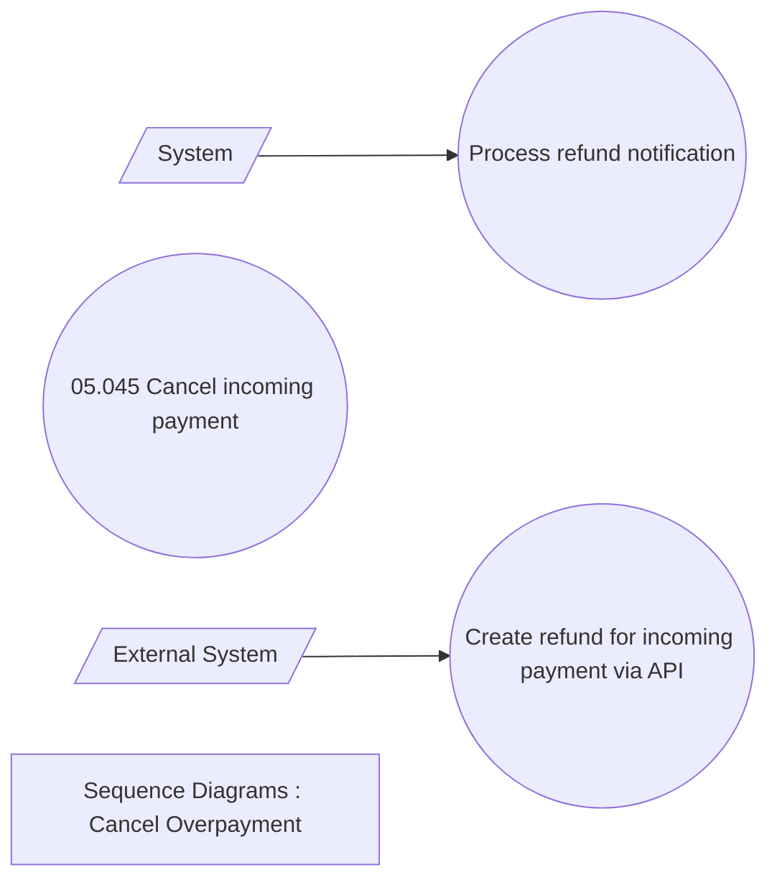

# Refund processing

- **Diagram Type**: Use Case
- **Package**: HomerSelect/BSL/Modules/Incoming Payments/Analytical Model/Refunds/Use Case Model
- **Diagram ID**: 164598
- **Elements**: 6
- **Connectors**: 2

