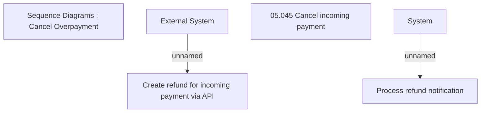

# Refund processing

```mermaid
graph TD
    Sequence_Diagrams_Cancel_Overpayment["Sequence Diagrams : Cancel Overpayment"]
    External_System["External System"]
    Process_refund_notification["Process refund notification"]
    Create_refund_for_incoming_payment_via_API["Create refund for incoming payment via API"]
    n_05_045_Cancel_incoming_payment["05.045 Cancel incoming payment"]
    System["System"]
    External_System -->|unnamed| Create_refund_for_incoming_payment_via_API
    System -->|unnamed| Process_refund_notification
```
