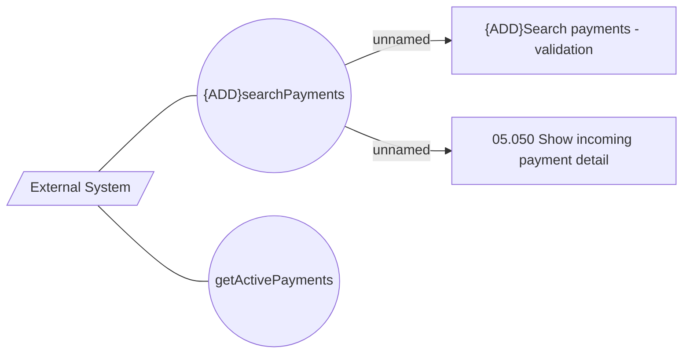

# Use Case Model

- **Diagram Type**: Use Case
- **Package**: HomerSelect/BSL/Modules/Incoming Payments/Interface provided/Provided REST API/Use Case Model
- **Diagram ID**: 163683
- **Elements**: 5
- **Connectors**: 4

