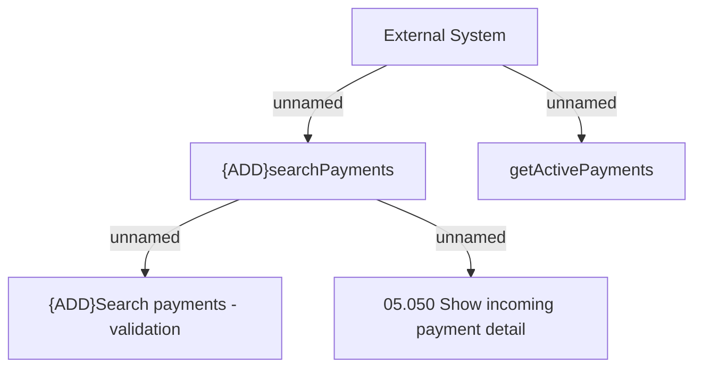

# Use Case Model

```mermaid
graph TD
    External_System["External System"]
    ADD_Search_payments_validation["{ADD}Search payments - validation"]
    ADD_searchPayments["{ADD}searchPayments"]
    getActivePayments["getActivePayments"]
    n_05_050_Show_incoming_payment_detail["05.050 Show incoming payment detail"]
    ADD_searchPayments -->|unnamed| ADD_Search_payments_validation
    ADD_searchPayments -->|unnamed| n_05_050_Show_incoming_payment_detail
    External_System -->|unnamed| getActivePayments
    External_System -->|unnamed| ADD_searchPayments
```
