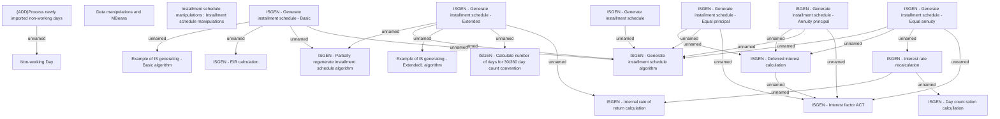

# ISGEN Generate installment schedule

```mermaid
graph TD
    ISGEN_Internal_rate_of_return_calculation["ISGEN - Internal rate of return calculation"]
    Example_of_IS_generating_Extended1_algorithm["Example of IS generating - Extended1 algorithm"]
    Example_of_IS_generating_Basic_algorithm["Example of IS generating - Basic algorithm"]
    Non_working_Day["Non-working Day"]
    ISGEN_EIR_calculation["ISGEN - EIR calculation"]
    ADD_Process_newly_imported_non_working_days["{ADD}Process newly imported non-working days"]
    ISGEN_Partially_regenerate_installment_schedule_algorithm["ISGEN - Partially regenerate installment schedule algorithm"]
    Data_manipulations_and_MBeans["Data manipulations and MBeans"]
    ISGEN_Calculate_number_of_days_for_30_360_day_count_conventi["ISGEN - Calculate number of days for 30/360 day count convention"]
    Installment_schedule_manipulations_Installment_schedule_mani["Installment schedule manipulations : Installment schedule manipulations"]
    ISGEN_Day_count_ration_calcullation["ISGEN - Day count ration calcullation"]
    ISGEN_Interest_rate_recalculation["ISGEN - Interest rate recalculation"]
    ISGEN_Interest_factor_ACT["ISGEN - Interest factor ACT"]
    ISGEN_Deferred_interest_calculation["ISGEN - Deferred interest calculation"]
    ISGEN_Generate_installment_schedule_Equal_principal["ISGEN - Generate installment schedule - Equal principal"]
    ISGEN_Generate_installment_schedule_Equal_annuity["ISGEN - Generate installment schedule - Equal annuity"]
    ISGEN_Generate_installment_schedule_Extended["ISGEN - Generate installment schedule - Extended"]
    ISGEN_Generate_installment_schedule_Basic["ISGEN - Generate installment schedule - Basic"]
    ISGEN_Generate_installment_schedule_Annuity_principal["ISGEN - Generate installment schedule - Annuity principal"]
    ISGEN_Generate_installment_schedule["ISGEN - Generate installment schedule"]
    ISGEN_Generate_installment_schedule_algorithm["ISGEN - Generate installment schedule algorithm"]
    ADD_Process_newly_imported_non_working_days -->|unnamed| Non_working_Day
    ISGEN_Generate_installment_schedule -->|unnamed| ISGEN_Generate_installment_schedule_algorithm
    ISGEN_Generate_installment_schedule_Extended -->|unnamed| ISGEN_Internal_rate_of_return_calculation
    ISGEN_Generate_installment_schedule_Extended -->|unnamed| ISGEN_Calculate_number_of_days_for_30_360_day_count_conventi
    ISGEN_Generate_installment_schedule_Extended -->|unnamed| Example_of_IS_generating_Extended1_algorithm
    ISGEN_Generate_installment_schedule_Extended -->|unnamed| ISGEN_Generate_installment_schedule_algorithm
    ISGEN_Generate_installment_schedule_Extended -->|unnamed| ISGEN_Partially_regenerate_installment_schedule_algorithm
    ISGEN_Generate_installment_schedule_Equal_annuity -->|unnamed| ISGEN_Interest_factor_ACT
    ISGEN_Generate_installment_schedule_Equal_annuity -->|unnamed| ISGEN_Interest_rate_recalculation
    ISGEN_Generate_installment_schedule_Equal_annuity -->|unnamed| ISGEN_Deferred_interest_calculation
    ISGEN_Generate_installment_schedule_Equal_annuity -->|unnamed| ISGEN_Generate_installment_schedule_algorithm
    ISGEN_Deferred_interest_calculation -->|unnamed| ISGEN_Interest_factor_ACT
    ISGEN_Generate_installment_schedule_Equal_principal -->|unnamed| ISGEN_Interest_factor_ACT
    ISGEN_Generate_installment_schedule_Annuity_principal -->|unnamed| ISGEN_Interest_factor_ACT
    ISGEN_Generate_installment_schedule_Basic -->|unnamed| ISGEN_Generate_installment_schedule_algorithm
    ISGEN_Generate_installment_schedule_Basic -->|unnamed| ISGEN_Partially_regenerate_installment_schedule_algorithm
    ISGEN_Generate_installment_schedule_Basic -->|unnamed| ISGEN_EIR_calculation
    ISGEN_Generate_installment_schedule_Basic -->|unnamed| Example_of_IS_generating_Basic_algorithm
    ISGEN_Interest_rate_recalculation -->|unnamed| ISGEN_Day_count_ration_calcullation
    ISGEN_Interest_rate_recalculation -->|unnamed| ISGEN_Internal_rate_of_return_calculation
    ISGEN_Generate_installment_schedule_Annuity_principal -->|unnamed| ISGEN_Generate_installment_schedule_algorithm
    ISGEN_Generate_installment_schedule_Annuity_principal -->|unnamed| ISGEN_Deferred_interest_calculation
    ISGEN_Generate_installment_schedule_Equal_principal -->|unnamed| ISGEN_Generate_installment_schedule_algorithm
    ISGEN_Generate_installment_schedule_Equal_principal -->|unnamed| ISGEN_Deferred_interest_calculation
```
