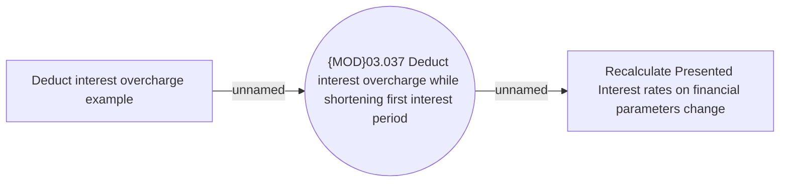

# Deducting interest overcharge while shortening first interest period

- **Diagram Type**: Use Case
- **Package**: HomerSelect/BSL/Modules/Installment Schedule
- **Diagram ID**: 147419
- **Elements**: 3
- **Connectors**: 2

