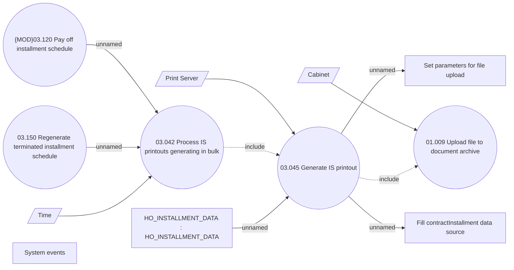

# Generating IS printouts

- **Diagram Type**: Use Case
- **Package**: HomerSelect/BSL/Modules/Installment Schedule
- **Diagram ID**: 147414
- **Elements**: 12
- **Connectors**: 10

```mermaid
graph LR
    Fill_contractInstallment_data_source["Fill contractInstallment data source"]
    HO_INSTALLMENT_DATA_HO_INSTALLMENT_DATA["HO_INSTALLMENT_DATA : HO_INSTALLMENT_DATA"]
    Set_parameters_for_file_upload["Set parameters for file upload"]
    Print_Server[/"Print Server"/]
    Time[/"Time"/]
    Cabinet[/"Cabinet"/]
    n_03_042_Process_IS_printouts_generating_in_bulk(("03.042 Process IS printouts generating in bulk"))
    n_01_009_Upload_file_to_document_archive(("01.009 Upload file to document archive"))
    n_03_045_Generate_IS_printout(("03.045 Generate IS printout"))
    n_03_150_Regenerate_terminated_installment_schedule(("03.150 Regenerate terminated installment schedule"))
    MOD_03_120_Pay_off_installment_schedule(("{MOD}03.120 Pay off installment schedule"))
    System_events["System events"]
    MOD_03_120_Pay_off_installment_schedule -->|unnamed| n_03_042_Process_IS_printouts_generating_in_bulk
    n_03_150_Regenerate_terminated_installment_schedule -->|unnamed| n_03_042_Process_IS_printouts_generating_in_bulk
    Time --> n_03_042_Process_IS_printouts_generating_in_bulk
    Cabinet --> n_01_009_Upload_file_to_document_archive
    Print_Server --> n_03_045_Generate_IS_printout
    n_03_042_Process_IS_printouts_generating_in_bulk -.->|include| n_03_045_Generate_IS_printout
    n_03_045_Generate_IS_printout -->|unnamed| Set_parameters_for_file_upload
    n_03_045_Generate_IS_printout -.->|include| n_01_009_Upload_file_to_document_archive
    n_03_045_Generate_IS_printout -->|unnamed| Fill_contractInstallment_data_source
    HO_INSTALLMENT_DATA_HO_INSTALLMENT_DATA -->|unnamed| n_03_045_Generate_IS_printout
```
