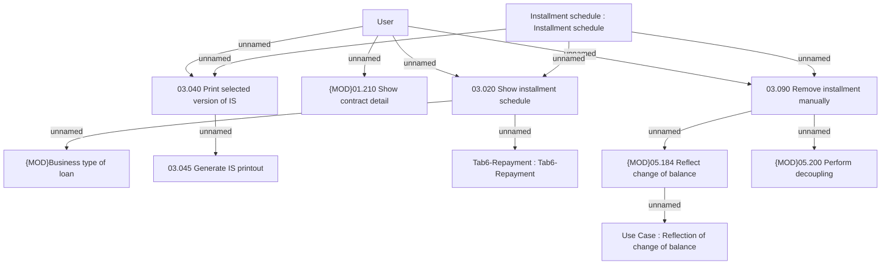

# Installment schedule management

```mermaid
graph TD
    MOD_Business_type_of_loan["{MOD}Business type of loan"]
    n_03_045_Generate_IS_printout["03.045 Generate IS printout"]
    n_03_040_Print_selected_version_of_IS["03.040 Print selected version of IS"]
    Tab6_Repayment_Tab6_Repayment["Tab6-Repayment : Tab6-Repayment"]
    MOD_01_210_Show_contract_detail["{MOD}01.210 Show contract detail"]
    Use_Case_Reflection_of_change_of_balance["Use Case : Reflection of change of balance"]
    MOD_05_184_Reflect_change_of_balance["{MOD}05.184 Reflect change of balance"]
    Installment_schedule_Installment_schedule["Installment schedule : Installment schedule"]
    User["User"]
    MOD_05_200_Perform_decoupling["{MOD}05.200 Perform decoupling"]
    n_03_090_Remove_installment_manually["03.090 Remove installment manually"]
    n_03_020_Show_installment_schedule["03.020 Show installment schedule"]
    n_03_020_Show_installment_schedule -->|unnamed| MOD_Business_type_of_loan
    User -->|unnamed| n_03_090_Remove_installment_manually
    User -->|unnamed| MOD_01_210_Show_contract_detail
    User -->|unnamed| n_03_020_Show_installment_schedule
    User -->|unnamed| n_03_040_Print_selected_version_of_IS
    n_03_040_Print_selected_version_of_IS -->|unnamed| n_03_045_Generate_IS_printout
    n_03_090_Remove_installment_manually -->|unnamed| MOD_05_200_Perform_decoupling
    n_03_090_Remove_installment_manually -->|unnamed| MOD_05_184_Reflect_change_of_balance
    MOD_05_184_Reflect_change_of_balance -->|unnamed| Use_Case_Reflection_of_change_of_balance
    n_03_020_Show_installment_schedule -->|unnamed| Tab6_Repayment_Tab6_Repayment
    Installment_schedule_Installment_schedule -->|unnamed| n_03_020_Show_installment_schedule
    Installment_schedule_Installment_schedule -->|unnamed| n_03_090_Remove_installment_manually
    Installment_schedule_Installment_schedule -->|unnamed| n_03_040_Print_selected_version_of_IS
```
