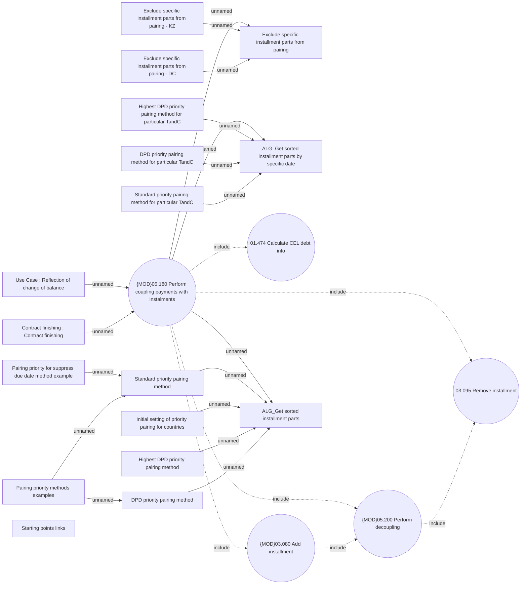

# Pairing installment parts procedure

- **Diagram Type**: Use Case
- **Package**: HomerSelect/BSL/Modules/Installment Schedule
- **Diagram ID**: 147417
- **Elements**: 22
- **Connectors**: 23

```mermaid
graph LR
    Exclude_specific_installment_parts_from_pairing_KZ["Exclude specific installment parts from pairing - KZ"]
    Exclude_specific_installment_parts_from_pairing_DC["Exclude specific installment parts from pairing - DC"]
    Exclude_specific_installment_parts_from_pairing["Exclude specific installment parts from pairing"]
    Standard_priority_pairing_method_for_particular_T_C["Standard priority pairing method for particular TandC"]
    DPD_priority_pairing_method_for_particular_T_C["DPD priority pairing method for particular TandC"]
    Highest_DPD_priority_pairing_method_for_particular_T_C["Highest DPD priority pairing method for particular TandC"]
    ALG_Get_sorted_installment_parts_by_specific_date["ALG_Get sorted installment parts by specific date"]
    Pairing_priority_for_suppress_due_date_method_example["Pairing priority for suppress due date method example"]
    Highest_DPD_priority_pairing_method["Highest DPD priority pairing method"]
    Use_Case_Reflection_of_change_of_balance["Use Case : Reflection of change of balance"]
    Initial_setting_of_priority_pairing_for_countries["Initial setting of priority pairing for countries"]
    Standard_priority_pairing_method["Standard priority pairing method"]
    DPD_priority_pairing_method["DPD priority pairing method"]
    Pairing_priority_methods_examples["Pairing priority methods examples"]
    n_01_474_Calculate_CEL_debt_info(("01.474 Calculate CEL debt info"))
    Contract_finishing_Contract_finishing["Contract finishing : Contract finishing"]
    MOD_03_080_Add_installment(("{MOD}03.080 Add installment"))
    n_03_095_Remove_installment(("03.095 Remove installment "))
    Starting_points_links["Starting points links"]
    ALG_Get_sorted_installment_parts["ALG_Get sorted installment parts"]
    MOD_05_180_Perform_coupling_payments_with_instalments(("{MOD}05.180 Perform coupling payments with instalments"))
    MOD_05_200_Perform_decoupling(("{MOD}05.200 Perform decoupling"))
    Use_Case_Reflection_of_change_of_balance -->|unnamed| MOD_05_180_Perform_coupling_payments_with_instalments
    Contract_finishing_Contract_finishing -->|unnamed| MOD_05_180_Perform_coupling_payments_with_instalments
    MOD_05_180_Perform_coupling_payments_with_instalments -->|unnamed| Exclude_specific_installment_parts_from_pairing
    MOD_05_180_Perform_coupling_payments_with_instalments -.->|include| MOD_05_200_Perform_decoupling
    MOD_05_180_Perform_coupling_payments_with_instalments -->|unnamed| ALG_Get_sorted_installment_parts
    MOD_05_180_Perform_coupling_payments_with_instalments -.->|include| n_01_474_Calculate_CEL_debt_info
    MOD_05_180_Perform_coupling_payments_with_instalments -.->|include| n_03_095_Remove_installment
    MOD_05_180_Perform_coupling_payments_with_instalments -->|unnamed| ALG_Get_sorted_installment_parts_by_specific_date
    MOD_05_180_Perform_coupling_payments_with_instalments -.->|include| MOD_03_080_Add_installment
    MOD_05_200_Perform_decoupling -.->|include| n_03_095_Remove_installment
    Pairing_priority_for_suppress_due_date_method_example -->|unnamed| Standard_priority_pairing_method
    Standard_priority_pairing_method -->|unnamed| ALG_Get_sorted_installment_parts
    Pairing_priority_methods_examples -->|unnamed| Standard_priority_pairing_method
    Initial_setting_of_priority_pairing_for_countries -->|unnamed| ALG_Get_sorted_installment_parts
    Highest_DPD_priority_pairing_method -->|unnamed| ALG_Get_sorted_installment_parts
    DPD_priority_pairing_method -->|unnamed| ALG_Get_sorted_installment_parts
    Highest_DPD_priority_pairing_method_for_particular_T_C -->|unnamed| ALG_Get_sorted_installment_parts_by_specific_date
    Pairing_priority_methods_examples -->|unnamed| DPD_priority_pairing_method
    Exclude_specific_installment_parts_from_pairing_KZ -->|unnamed| Exclude_specific_installment_parts_from_pairing
    Exclude_specific_installment_parts_from_pairing_DC -->|unnamed| Exclude_specific_installment_parts_from_pairing
    DPD_priority_pairing_method_for_particular_T_C -->|unnamed| ALG_Get_sorted_installment_parts_by_specific_date
    Standard_priority_pairing_method_for_particular_T_C -->|unnamed| ALG_Get_sorted_installment_parts_by_specific_date
    MOD_03_080_Add_installment -.->|include| MOD_05_200_Perform_decoupling
```
