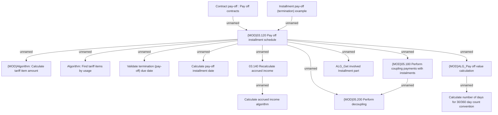

# Pay off instalment schedule

```mermaid
graph TD
    MOD_Algorithm_Calculate_tariff_item_amount["{MOD}Algorithm: Calculate tariff item amount"]
    Algorithm_Find_tariff_items_by_usage["Algorithm: Find tariff items by usage"]
    Validate_termination_pay_off_due_date["Validate termination (pay-off) due date"]
    Calculate_pay_off_installment_date["Calculate pay-off installment date"]
    n_03_140_Recalculate_accrued_income["03.140 Recalculate accrued income"]
    Calculate_accrued_income_algorithm["Calculate accrued income algorithm"]
    Calculate_number_of_days_for_30_360_day_count_convention["Calculate number of days for 30/360 day count convention"]
    Installment_pay_off_termination_example["Installment pay-off (termination) example"]
    MOD_ALG_Pay_off_value_calculation["{MOD}ALG_Pay off value calculation"]
    ALG_Get_involved_Installment_part["ALG_Get involved Installment part"]
    MOD_05_200_Perform_decoupling["{MOD}05.200 Perform decoupling"]
    MOD_05_180_Perform_coupling_payments_with_instalments["{MOD}05.180 Perform coupling payments with instalments"]
    Contract_pay_off_Pay_off_contracts["Contract pay-off : Pay off contracts"]
    MOD_03_120_Pay_off_installment_schedule["{MOD}03.120 Pay off installment schedule"]
    Contract_pay_off_Pay_off_contracts -->|unnamed| MOD_03_120_Pay_off_installment_schedule
    MOD_ALG_Pay_off_value_calculation -->|unnamed| Calculate_number_of_days_for_30_360_day_count_convention
    MOD_03_120_Pay_off_installment_schedule -->|unnamed| Algorithm_Find_tariff_items_by_usage
    MOD_03_120_Pay_off_installment_schedule -->|unnamed| MOD_Algorithm_Calculate_tariff_item_amount
    n_03_140_Recalculate_accrued_income -->|unnamed| Calculate_accrued_income_algorithm
    MOD_03_120_Pay_off_installment_schedule -->|unnamed| n_03_140_Recalculate_accrued_income
    Installment_pay_off_termination_example -->|unnamed| MOD_03_120_Pay_off_installment_schedule
    MOD_03_120_Pay_off_installment_schedule -->|unnamed| MOD_05_200_Perform_decoupling
    MOD_03_120_Pay_off_installment_schedule -->|unnamed| MOD_05_180_Perform_coupling_payments_with_instalments
    MOD_03_120_Pay_off_installment_schedule -->|unnamed| Calculate_pay_off_installment_date
    MOD_03_120_Pay_off_installment_schedule -->|unnamed| MOD_ALG_Pay_off_value_calculation
    MOD_03_120_Pay_off_installment_schedule -->|unnamed| ALG_Get_involved_Installment_part
    MOD_03_120_Pay_off_installment_schedule -->|unnamed| Validate_termination_pay_off_due_date
    MOD_05_180_Perform_coupling_payments_with_instalments -->|unnamed| MOD_05_200_Perform_decoupling
```
