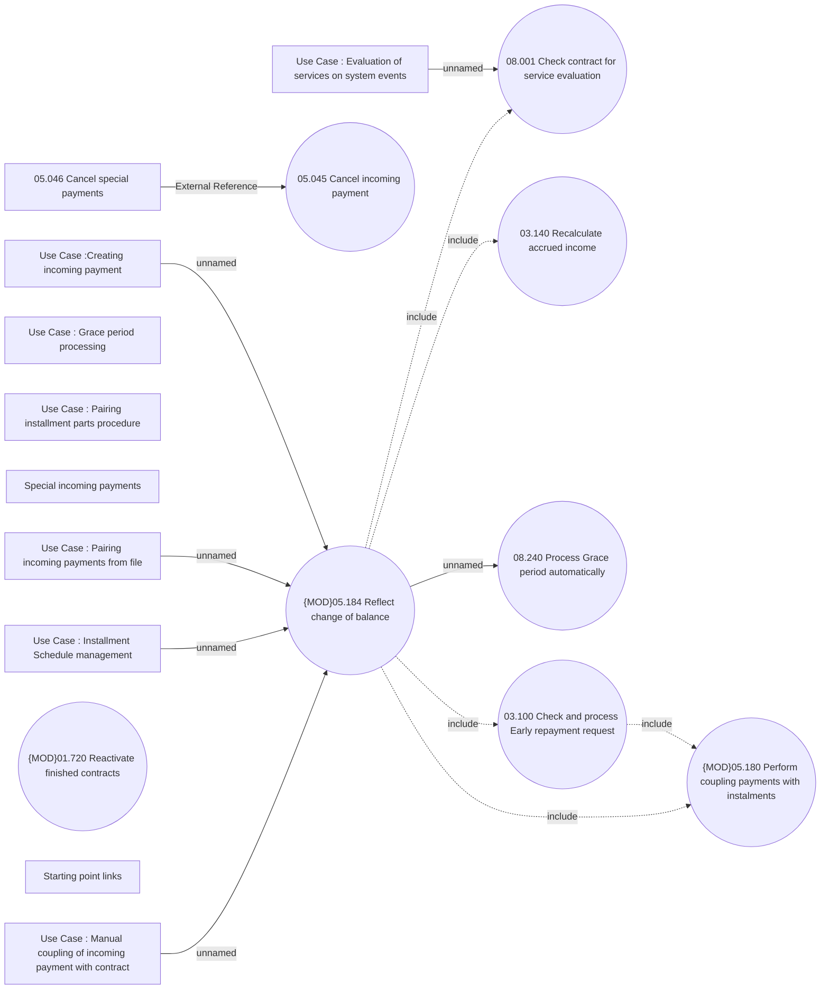

# Reflection of change of balance

- **Diagram Type**: Use Case
- **Package**: HomerSelect/BSL/Modules/Installment Schedule
- **Diagram ID**: 147418
- **Elements**: 18
- **Connectors**: 13

```mermaid
graph LR
    n_05_046_Cancel_special_payments["05.046 Cancel special payments"]
    Use_Case_Evaluation_of_services_on_system_events["Use Case : Evaluation of services on system events"]
    Use_Case_Pairing_incoming_payments_from_file["Use Case : Pairing incoming payments from file"]
    n_08_001_Check_contract_for_service_evaluation(("08.001 Check contract for service evaluation"))
    Use_Case_Grace_period_processing["Use Case : Grace period processing"]
    Use_Case_Pairing_installment_parts_procedure["Use Case : Pairing installment parts procedure"]
    n_03_140_Recalculate_accrued_income(("03.140 Recalculate accrued income"))
    Special_incoming_payments["Special incoming payments"]
    n_08_240_Process_Grace_period_automatically(("08.240 Process Grace period automatically"))
    Use_Case_Installment_Schedule_management["Use Case : Installment Schedule management"]
    Use_Case_Creating_incoming_payment["Use Case :Creating incoming payment"]
    MOD_05_180_Perform_coupling_payments_with_instalments(("{MOD}05.180 Perform coupling payments with instalments"))
    n_05_045_Cancel_incoming_payment(("05.045 Cancel incoming payment"))
    MOD_01_720_Reactivate_finished_contracts(("{MOD}01.720 Reactivate finished contracts"))
    Starting_point_links["Starting point links"]
    Use_Case_Manual_coupling_of_incoming_payment_with_contract["Use Case : Manual coupling of incoming payment with contract"]
    MOD_05_184_Reflect_change_of_balance(("{MOD}05.184 Reflect change of balance"))
    n_03_100_Check_and_process_Early_repayment_request(("03.100 Check and process Early repayment request"))
    MOD_05_184_Reflect_change_of_balance -.->|include| n_03_100_Check_and_process_Early_repayment_request
    Use_Case_Creating_incoming_payment -->|unnamed| MOD_05_184_Reflect_change_of_balance
    Use_Case_Pairing_incoming_payments_from_file -->|unnamed| MOD_05_184_Reflect_change_of_balance
    Use_Case_Installment_Schedule_management -->|unnamed| MOD_05_184_Reflect_change_of_balance
    Use_Case_Manual_coupling_of_incoming_payment_with_contract -->|unnamed| MOD_05_184_Reflect_change_of_balance
    Use_Case_Evaluation_of_services_on_system_events -->|unnamed| n_08_001_Check_contract_for_service_evaluation
    MOD_05_184_Reflect_change_of_balance -.->|include| n_08_001_Check_contract_for_service_evaluation
    n_03_100_Check_and_process_Early_repayment_request -.->|include| MOD_05_180_Perform_coupling_payments_with_instalments
    MOD_05_184_Reflect_change_of_balance -.->|include| MOD_05_180_Perform_coupling_payments_with_instalments
    MOD_05_184_Reflect_change_of_balance -.->|include| n_03_140_Recalculate_accrued_income
    MOD_05_184_Reflect_change_of_balance -->|unnamed| n_08_240_Process_Grace_period_automatically
    n_05_046_Cancel_special_payments -->|External Reference| n_05_045_Cancel_incoming_payment
```
