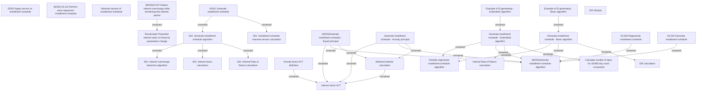

# ISG - Generate installment schedule

```mermaid
graph TD
    ISG02_Apply_service_on_installment_schedule["ISG02 Apply service on installment schedule"]
    MOD_03_110_Perform_early_repayment_installment_schedule["{MOD} 03.110 Perform early repayment installment schedule"]
    ISG_Installment_schedule_maximal_version_calculation["ISG: Installment schedule maximal version calculation"]
    Maximal_Version_of_Installment_Schedule["Maximal Version of Installment Schedule"]
    ISG_Interest_overcharge_deduction_algorithm["ISG: Interest overcharge deduction algorithm"]
    Recalculate_Presented_Interest_rates_on_financial_parameters["Recalculate Presented Interest rates on financial parameters change"]
    MOD_03_037_Deduct_interest_overcharge_while_shortening_first["{MOD}03.037 Deduct interest overcharge while shortening first interest period"]
    ISG_Interest_factor_calculation["ISG: Interest factor calculation"]
    Interest_factor_ACT["Interest factor ACT"]
    ISG_Internal_Rate_of_Return_calculation["ISG: Internal Rate of Return calculation"]
    ISG_Generate_installment_schedule_algorithm["ISG: Generate installment schedule algorithm"]
    ISG01_Generate_installment_schedule["ISG01 Generate installment schedule"]
    Annuity_factor_ACT_definition["Annuity factor ACT definition"]
    Partially_regenerate_installment_schedule_algorithm["Partially regenerate installment schedule algorithm"]
    Deferred_Interest_calculation["Deferred Interest calculation"]
    MOD_Generate_installment_schedule_Equal_principal["{MOD}Generate installment schedule - Equal principal"]
    Generate_installment_schedule_Annuity_principal["Generate installment schedule - Annuity principal"]
    Internal_Rate_of_Return_calculation["Internal Rate of Return calculation"]
    EIR_calculation["EIR calculation"]
    Example_of_IS_generating_Basic_algorithm["Example of IS generating - Basic algorithm"]
    Example_of_IS_generating_Extended1_algorithm["Example of IS generating - Extended1 algorithm"]
    Generate_installment_schedule_Extended1_algorithm["Generate installment schedule - Extended1 algorithm"]
    Generate_installment_schedule_Basic_algorithm["Generate installment schedule - Basic algorithm"]
    Calculate_number_of_days_for_30_360_day_count_convention["Calculate number of days for 30/360 day count convention"]
    n_03_030_Regenerate_installment_schedule["03.030 Regenerate installment schedule"]
    MOD_Generate_installment_schedule_algorithm["{MOD}Generate installment schedule algorithm"]
    n_03_010_Generate_installment_schedule["03.010 Generate installment schedule"]
    ISG_Module["ISG Module"]
    ISG_Generate_installment_schedule_algorithm -->|unnamed| ISG_Interest_overcharge_deduction_algorithm
    ISG_Generate_installment_schedule_algorithm -->|unnamed| ISG_Interest_factor_calculation
    MOD_Generate_installment_schedule_Equal_principal -->|unnamed| Interest_factor_ACT
    Generate_installment_schedule_Annuity_principal -->|unnamed| Interest_factor_ACT
    ISG_Generate_installment_schedule_algorithm -->|unnamed| ISG_Internal_Rate_of_Return_calculation
    ISG01_Generate_installment_schedule -->|unnamed| ISG_Generate_installment_schedule_algorithm
    ISG01_Generate_installment_schedule -->|unnamed| ISG_Installment_schedule_maximal_version_calculation
    Generate_installment_schedule_Extended1_algorithm -->|unnamed| Partially_regenerate_installment_schedule_algorithm
    Generate_installment_schedule_Extended1_algorithm -->|unnamed| MOD_Generate_installment_schedule_algorithm
    Generate_installment_schedule_Extended1_algorithm -->|unnamed| Internal_Rate_of_Return_calculation
    Generate_installment_schedule_Extended1_algorithm -->|unnamed| Calculate_number_of_days_for_30_360_day_count_convention
    Generate_installment_schedule_Basic_algorithm -->|unnamed| Partially_regenerate_installment_schedule_algorithm
    MOD_Generate_installment_schedule_Equal_principal -->|unnamed| MOD_Generate_installment_schedule_algorithm
    Generate_installment_schedule_Annuity_principal -->|unnamed| MOD_Generate_installment_schedule_algorithm
    Generate_installment_schedule_Basic_algorithm -->|unnamed| MOD_Generate_installment_schedule_algorithm
    Generate_installment_schedule_Annuity_principal -->|unnamed| Deferred_Interest_calculation
    Generate_installment_schedule_Basic_algorithm -->|unnamed| EIR_calculation
    MOD_Generate_installment_schedule_Equal_principal -->|unnamed| Deferred_Interest_calculation
    n_03_030_Regenerate_installment_schedule -->|unnamed| MOD_Generate_installment_schedule_algorithm
    n_03_010_Generate_installment_schedule -->|unnamed| MOD_Generate_installment_schedule_algorithm
    Example_of_IS_generating_Extended1_algorithm -->|unnamed| Generate_installment_schedule_Extended1_algorithm
    Example_of_IS_generating_Basic_algorithm -->|unnamed| Generate_installment_schedule_Basic_algorithm
    MOD_03_037_Deduct_interest_overcharge_while_shortening_first -->|unnamed| Recalculate_Presented_Interest_rates_on_financial_parameters
    Annuity_factor_ACT_definition -->|unnamed| Interest_factor_ACT
    Deferred_Interest_calculation -->|unnamed| Interest_factor_ACT
```
