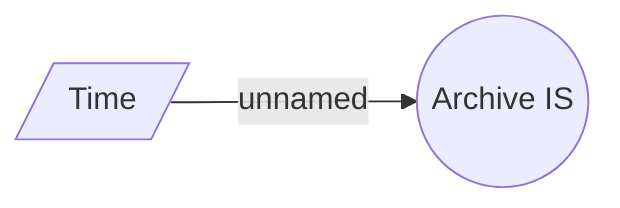

# Archive job

- **Diagram Type**: Use Case
- **Package**: HomerSelect/BSL/Modules/Installment schedule management/Analytical Model/Archive job
- **Diagram ID**: 151156
- **Elements**: 2
- **Connectors**: 1

