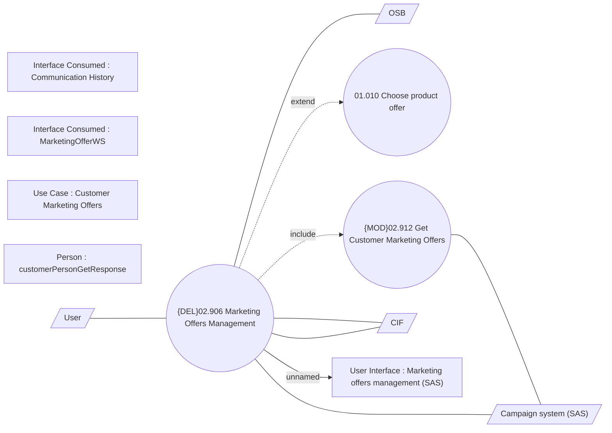

# Management of Marketing Offers

- **Diagram Type**: Use Case
- **Package**: HomerSelect/BSL/Modules/Marketing Offer/Analytical Model/Marketing Offer Management (SAS)/Use Case
- **Diagram ID**: 148813
- **Elements**: 12
- **Connectors**: 9

